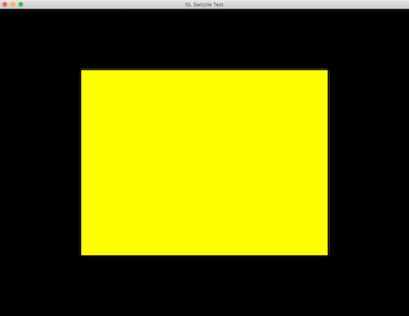
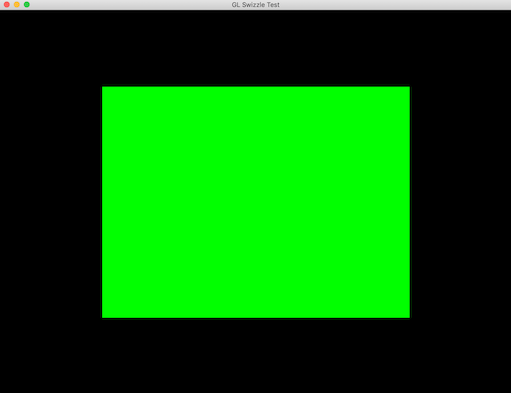

## GL Buster

This is a simple program that tests against a few known GL driver issues for [WebRender](https://github.com/servo/webrender) needs. It uses [glow](https://github.com/grovesNL/glow) GL bindings on [surfman](https://github.com/servo/surfman) window-less context.

Example output:
```
Init with renderer: AMD Radeon Pro 460 OpenGL Engine
Test: swizzle
	Relevant extensions: GL_ARB_texture_swizzle
	textureSize: PASS
Test: PBO uploads
	offset-128px: PASS
	layer-1: PASS
Done
```

## Swizzling

Swizzling can break the texture unit meta-data with Intel 4000 GPUs on Mac.

### NVIDIA GeForce GT 650M OpenGL Engine



### Intel HD Graphics 4000 OpenGL Engine


